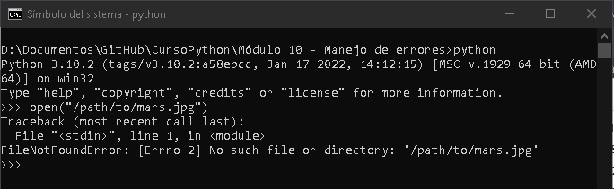
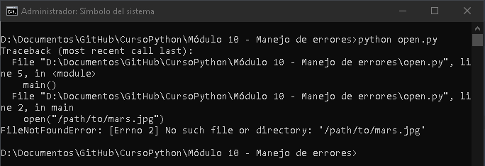
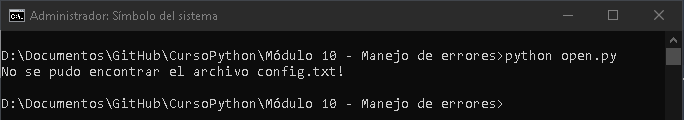
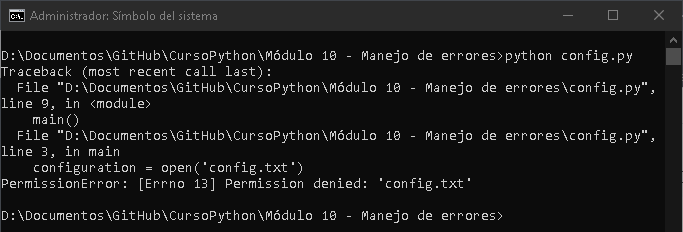
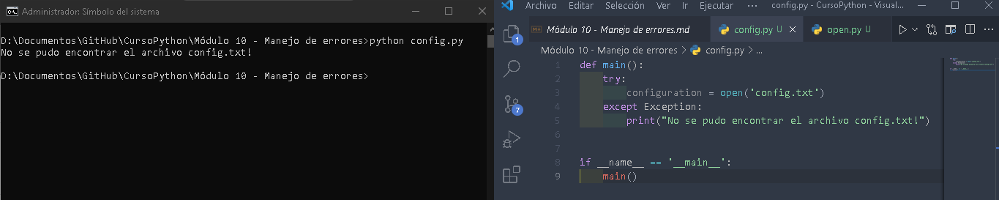
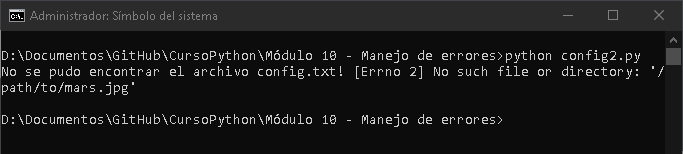

## Tracebacks

Si intentamos en un notebook, abrir un archivo inexistente sucede lo siguiente:

Se trata de una sola función `main()` que abre el archivo inexistente, como antes. Al final, esta función usa un asistente de Python que indica al intérprete que ejecute la función `main()` cuando se le llama en el terminal. Ejecútala con Python y podrás comprobar el siguiente mensaje de error:

## Try y Except de los bloques

Vamos a usar el ejemplo de navegador a fin de crear código que abra archivos de configuración para la misión de Marte. Los archivos de configuración pueden tener todo tipo de problemas, por lo que es fundamental notificarlos con precisión cuando se presenten. Sabemos que, si no existe un archivo o directorio, se genera `FileNotFoundError`. Si queremos controlar esa excepción, podemos hacerlo con un bloque try y except:

A continuación, quita,ps el archivo *config.txt* y creamos un directorio denominado *config.txt*. Intentaremos llamar al archivo *config.py* para ver un error nuevo que debería ser similar al siguiente:

Una manera poco útil de controlar este error sería detectar todas las excepciones posibles para evitar un traceback. Para comprender por qué detectar todas las excepciones es problemático, probaremos actualizando la función `main()`:

Vamos a corregir este fragmento de código para abordar todas estas frustraciones. Revertiremos la detección de `FileNotFoundError` y luego agregamos otro bloque `except` para detectar `PermissionError`:

Eliminamos el archivo config.txt para asegurarnos de que se alcanza el primer bloque `except` en su lugar:

Si necesitas acceder al error asociado a la excepción, debes actualizar la línea `except` para incluir la palabra clave `as`. Esta técnica es práctica si una excepción es demasiado genérica y el mensaje de error puede ser útil:

En este caso, `as err` significa que `err` se convierte en una variable con el objeto de excepción como valor. Después, usa este valor para imprimir el mensaje de error asociado a la excepción. Otra razón para usar esta técnica es acceder directamente a los atributos del error. Por ejemplo, si detecta una excepción `OSError` más genérica, que es la excepción primaria de `FilenotFoundError` y `PermissionError`, podemos diferenciarlas mediante el atributo `.errno`:

